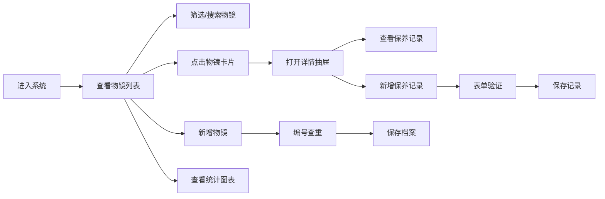
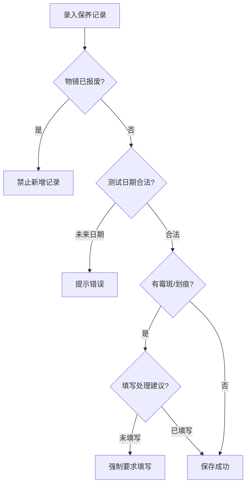

## 1. 产品概述

本系统是一款专业的显微镜物镜档案管理工具，为显微镜收藏家和维修工作室提供物镜保养记录、损伤状态追踪和成像测试结果管理。系统支持物镜档案录入、保养记录、状态筛选和数据可视化分析。

## 2. 核心功能

### 2.1 用户角色

| 角色 | 注册方式 | 核心权限 |
|------|----------|----------|
| 管理员/用户 | 本地使用 | 物镜档案管理、保养记录录入、数据统计分析 |

### 2.2 功能模块

1. **物镜档案管理**: 物镜列表展示、新增物镜、编辑物镜、报废管理
2. **保养记录管理**: 保养记录录入、历史记录查看、处理建议
3. **数据统计分析**: 倍率分布图表、评分趋势图、状态统计
4. **筛选与搜索**: 损伤状态筛选、品牌/倍率筛选、关键词搜索

### 2.3 页面详情

| 页面名称 | 模块名称 | 功能描述 |
|----------|----------|----------|
| 主页面 | 头部导航 | 系统标题、新增物镜按钮、统计概览 |
| 主页面 | 筛选区域 | 损伤状态筛选、品牌筛选、倍率筛选、搜索框 |
| 主页面 | 物镜列表 | 卡片式展示物镜基本信息、状态标签、操作按钮 |
| 详情抽屉 | 物镜详情 | 完整展示物镜所有字段信息 |
| 详情抽屉 | 保养记录列表 | 时间线展示历史保养记录 |
| 详情抽屉 | 新增保养记录 | 表单录入测试结果和处理建议 |
| 统计面板 | 倍率分布图 | 饼图展示各倍率物镜数量分布 |
| 统计面板 | 评分趋势图 | 折线图展示成像评分变化趋势 |

## 3. 核心流程

### 业务约束流程

## 4. 用户界面设计

### 4.1 设计风格

**专业精密仪器风格**
- **主色调**: 深蓝灰色系 (#1e293b)，体现专业精密感
- **辅助色**: 科技蓝 (#3b82f6)、警示橙 (#f59e0b)、危险红 (#ef4444)、成功绿 (#10b981)
- **背景**: 深色渐变背景，带有微妙的网格纹理
- **卡片**: 半透明玻璃态效果，细微边框和阴影

**按钮风格**:
- 圆角设计 (radius: 8px)
- 悬浮状态有轻微上浮和发光效果
- 危险操作按钮使用红色强调

**字体**:
- 标题: JetBrains Mono (等宽字体，体现科技感)
- 正文: Inter (清晰易读)

**布局风格**:
- 顶部导航 + 侧边统计面板 + 主内容区
- 卡片式列表展示
- 右侧抽屉式详情页

**图标风格**:
- 使用 Tabler Icons 线性图标
- 状态使用 emoji 标识: 🔬 完好、⚠️ 划痕、🟤 霉斑、❌ 报废

### 4.2 页面设计概述

| 页面名称 | 模块名称 | UI 元素 |
|----------|----------|---------|
| 主页面 | 头部导航 | 深色背景、系统标题、新增物镜按钮、统计指标卡片 |
| 主页面 | 筛选区域 | 标签组筛选、下拉选择、搜索输入框 |
| 主页面 | 物镜列表 | 网格布局卡片、状态标签色标、悬停动效 |
| 详情抽屉 | 物镜信息 | 字段分组展示、状态高亮、编辑按钮 |
| 详情抽屉 | 保养记录 | 时间线布局、评分星级、损伤标记 |
| 统计面板 | 图表区域 | Recharts 图表、渐变色填充、交互动效 |

### 4.3 响应式设计

- **桌面端优先**: 三列布局 (侧边统计 + 主列表 + 抽屉详情)
- **平板端**: 两列布局，抽屉全屏覆盖
- **移动端**: 单列布局，底部导航切换
- 触摸区域优化，确保移动端可操作性

### 4.4 动效设计

- 页面加载: 卡片渐入动画 (staggered fade-in)
- 抽屉展开: 平滑滑动 + 背景模糊
- 状态变更: 颜色过渡动画
- 图表: 数据加载动画
