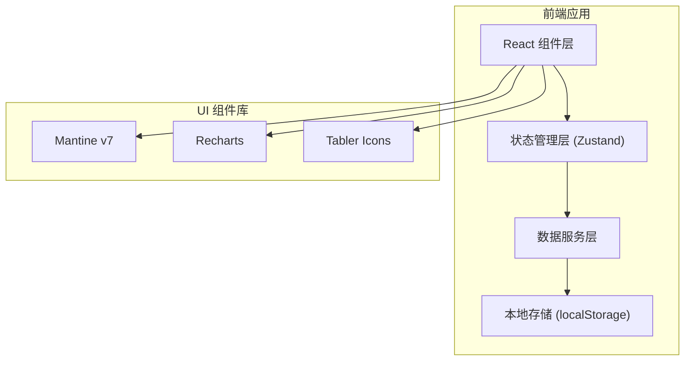
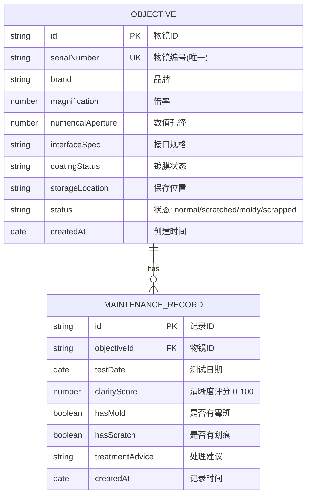

## 1. 架构设计



## 2. 技术栈说明

- **前端框架**: React 18 + TypeScript 5
- **构建工具**: Vite 5
- **UI 组件库**: Mantine v7 (核心组件、表单、日期选择器)
- **图表库**: Recharts 2
- **图标库**: @tabler/icons-react
- **状态管理**: Zustand (轻量级状态管理)
- **数据持久化**: localStorage (模拟数据存储)
- **样式方案**: Mantine CSS-in-JS + 自定义主题
- **表单验证**: Mantine Form + 自定义验证规则

## 3. 目录结构

```
src/
├── components/          # 组件目录
│   ├── ObjectiveList/   # 物镜列表组件
│   ├── ObjectiveCard/   # 物镜卡片组件
│   ├── DetailDrawer/    # 详情抽屉组件
│   ├── MaintenanceForm/ # 保养记录表单
│   ├── StatsPanel/      # 统计面板
│   ├── FilterBar/       # 筛选栏
│   └── ObjectiveForm/   # 物镜表单
├── store/               # 状态管理
│   └── objectiveStore.ts
├── types/               # TypeScript 类型定义
│   └── index.ts
├── utils/               # 工具函数
│   ├── validation.ts    # 验证规则
│   └── mockData.ts      # 模拟数据
├── hooks/               # 自定义 Hooks
├── App.tsx              # 主应用组件
├── main.tsx             # 入口文件
└── theme.ts             # Mantine 主题配置
```

## 4. 数据模型

### 4.1 ER 图



### 4.2 TypeScript 类型定义

```typescript
// 物镜状态枚举
type ObjectiveStatus = 'normal' | 'scratched' | 'moldy' | 'scrapped';

// 物镜接口
interface Objective {
  id: string;
  serialNumber: string;
  brand: string;
  magnification: number;
  numericalAperture: number;
  interfaceSpec: string;
  coatingStatus: string;
  storageLocation: string;
  status: ObjectiveStatus;
  createdAt: string;
}

// 保养记录接口
interface MaintenanceRecord {
  id: string;
  objectiveId: string;
  testDate: string;
  clarityScore: number;
  hasMold: boolean;
  hasScratch: boolean;
  treatmentAdvice: string;
  createdAt: string;
}

// 筛选条件
interface FilterOptions {
  status?: ObjectiveStatus;
  brand?: string;
  magnification?: number;
  search?: string;
}
```

## 5. 表单验证规则

### 5.1 物镜表单验证
- **物镜编号**: 必填，唯一性校验
- **品牌**: 必填
- **倍率**: 必填，数字，> 0
- **数值孔径**: 必填，数字，0 < NA ≤ 1.4
- **接口规格**: 必填
- **保存位置**: 必填

### 5.2 保养记录验证
- **测试日期**: 必填，不能晚于当前日期
- **清晰度评分**: 必填，0-100 整数
- **处理建议**: 当 `hasMold` 或 `hasScratch` 为 true 时必填
- **物镜状态**: 已报废 (`scrapped`) 的物镜不能新增记录

## 6. 核心组件说明

| 组件名称 | 主要职责 | Props |
|----------|----------|-------|
| `ObjectiveCard` | 展示物镜摘要信息，点击打开详情 | `objective: Objective` |
| `ObjectiveList` | 物镜列表渲染，支持网格布局 | `objectives: Objective[]` |
| `DetailDrawer` | 右侧抽屉，展示详情和保养记录 | `objective: Objective`, `onClose` |
| `MaintenanceForm` | 保养记录录入表单 | `objectiveId: string`, `onSubmit` |
| `ObjectiveForm` | 新增/编辑物镜表单 | `objective?: Objective`, `onSubmit` |
| `StatsPanel` | 统计图表展示面板 | `objectives: Objective[]`, `records: MaintenanceRecord[]` |
| `FilterBar` | 筛选和搜索组件 | `onFilterChange`, `brands`, `magnifications` |

## 7. 状态管理设计

### Zustand Store 结构

```typescript
interface ObjectiveStore {
  objectives: Objective[];
  records: MaintenanceRecord[];
  selectedObjective: Objective | null;
  filters: FilterOptions;
  
  // Actions
  addObjective: (obj: Omit<Objective, 'id' | 'createdAt'>) => void;
  updateObjective: (id: string, data: Partial<Objective>) => void;
  deleteObjective: (id: string) => void;
  addRecord: (record: Omit<MaintenanceRecord, 'id' | 'createdAt'>) => void;
  setSelectedObjective: (obj: Objective | null) => void;
  setFilters: (filters: Partial<FilterOptions>) => void;
  
  // Computed
  getFilteredObjectives: () => Objective[];
  getRecordsByObjectiveId: (id: string) => MaintenanceRecord[];
  isSerialNumberUnique: (sn: string, excludeId?: string) => boolean;
}
```

## 8. Mock 数据

系统预置 10-15 条物镜数据，包含不同品牌、倍率、状态，每条物镜有 3-5 条保养记录，用于演示图表和列表功能。
